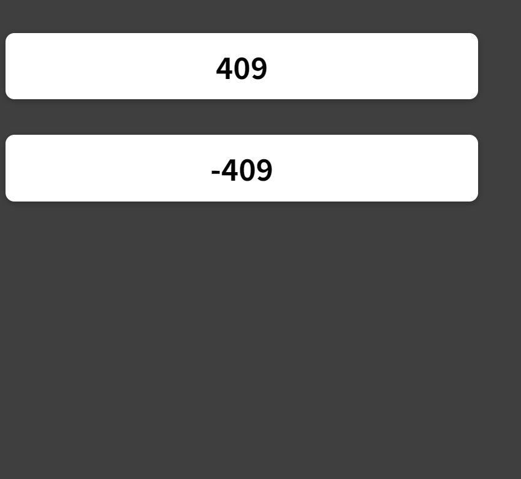
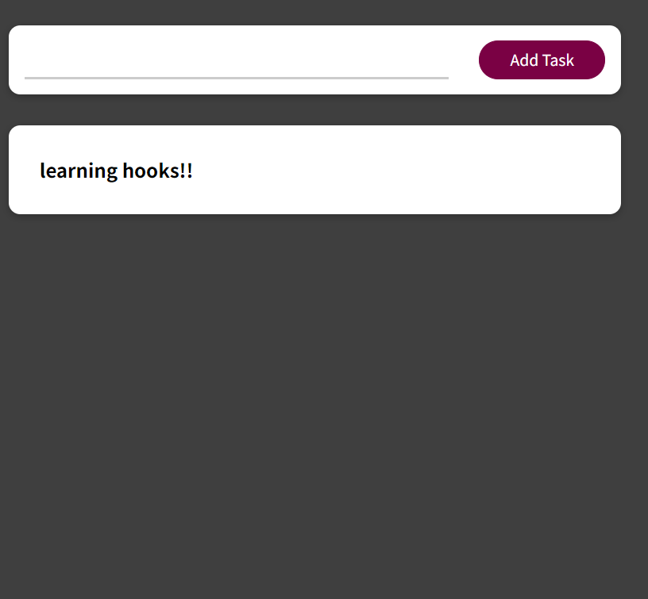

Using Custom React Hooks: Two Examples
This README provides two examples of using custom React hooks to simplify and improve your React applications. The first example is a counter app, and the second example involves making HTTP requests for GET and POST operations. Each example includes a "before" and "after" section to demonstrate the benefits of using custom hooks.

To run the code go to the file:
npm install
npm start

first app

Second App

